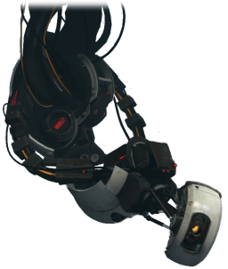
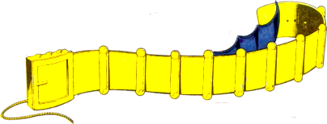
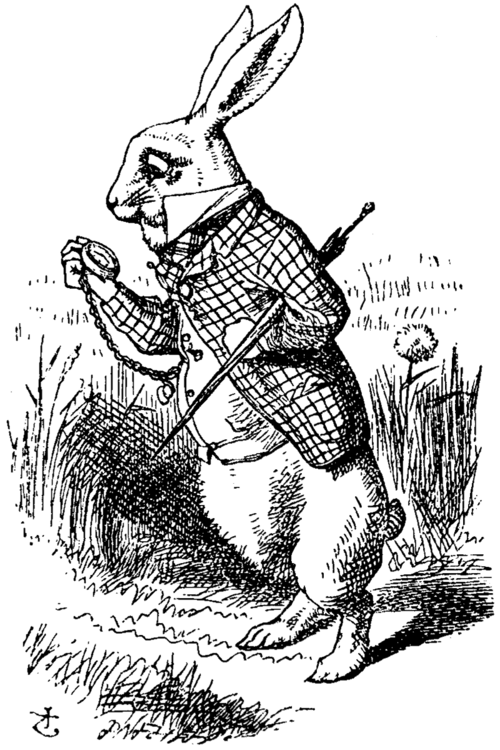
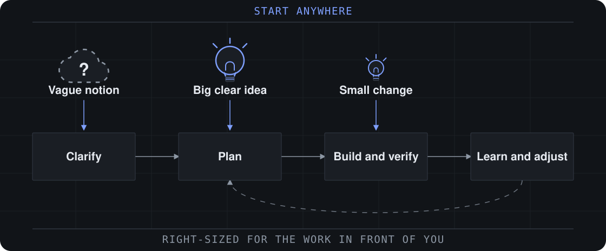

<!-- _class: lead -->



<div class="scratched">Multi-Agent Structure</div>
<div class="scratched">Agent Optimization Science</div>

# Surviving the AI Age

## How to be a 10x Engineer

<div class="byline">JC &middot; 2026-09-18</div>

<!--
Let the two crossed-out titles sit for a beat. The joke is that the
honest title is the one nobody would put on a conference abstract.

The deck is a ladder, climbed one rung at a time: you get faster, then
you hit a wall that the next rung exists to clear. Ask "how do we 10x
again?" out loud at each wall -- the room starts answering before you
do.

The agenda that follows is five words on purpose. The room should feel
the climb rather than see it mapped, because the shape of the ladder is a
reveal near the end, and what is missing from it is the point.

Do not answer the title here. The closing slide answers it, and the
answer is that you don't stay one.
-->

---

<!-- _class: agenda -->


# Agenda

1. **Speed run overview of the basics**
1. **Scaling up with agents**
1. **Research to ground us**
1. **Theory and practice**
1. **Questions**

<!--
Ten seconds, not a minute. Read the five words and move.

The middle three are the talk: we climb, the climb runs out of demos,
the research says what the demos cannot.

Do not expand "theory and practice" -- the shape of the ladder and what
is missing from it is a reveal near the end, and naming it here spends
it early.
-->

---

<!-- _class: belt -->



# Let's make sure we have our AI tool belt

<div class="columns3">
<div class="card"><h3>Hooks</h3>Deterministic<br>When events happen</div>
<div class="card"><h3>Skills</h3>Custom workflows<br>Loaded when relevant</div>
<div class="card"><h3>Agents</h3>
Parallelism
<br>
Isolation
<br>
Expensive
</div>
</div>

<br>

- **Reach for them in that order**
- If a hook can do it, a skill should not
- If a skill can do it, an agent should not

<!--
Hooks are shell commands the harness runs, not decisions the model
makes. Format after every edit. Block a commit to main. Log every
spawn.

Skills: "how we cut a release", "how we review a migration". Rule of
thumb -- the second time you type the same prompt, it should have been a
skill.

Agents are the only primitive that costs real tokens: a separate context
with its own tools. Fan out over files, sources, or hypotheses.

This slide exists so nobody spends the talk thinking every problem needs
a swarm. Most repos get more from four hooks and two skills than from
any topology in this deck.
-->

---

# Problem: How to be a 10x engineer

---

<!-- _class: multiply -->



# Fix: Multiply

```sh
claude "add the cache"          # three terminals
claude "port the tests"         # one repo
claude "update the docs"
```

- One agent is a conversation
- Classic way to scale: **hire more**
- 3× throughput... right?

<!--
The move is instinctive and it is not stupid. It is exactly what you
would do with three contractors and no process.
-->

---

# Problem: Thrash

- Changing, conflicting requirements
- Reading each other's changes that may be unrelated
- Writing conflicts
- All on one branch, so it's confusing together

<!--
This is thrash, and it is not an agent problem. Put three people on one
checkout with no branches and you get the identical mess.

Other flavours if the room wants them: one agent pip-installs something
and breaks another's run; two agents "fix" the same failing test in
opposite directions; a long-running agent holds a lock.

The fix is the one we already use for people, and for the same reason:
give each worker its own copy.
-->

---

# Fix: Isolation

- **By checkout** — one worktree each
- **By partition** — one directory per agent
- **By context** — separate sessions, separate history

<br>

- Buys: no races, one PR per chunk, throwaway runs
- Costs: **merge conflicts**, moved to review time

<!--
A worktree is its own directory and branch over one shared object store,
so no agent can see another's half-written file.

The line worth saying out loud: isolation is the one thing a smarter
single model still cannot do for you. No model is in two worktrees at
once. That is physics, and it survives every model upgrade.

The cost is real. Isolation does not remove the conflict, it moves it to
the end where a human resolves it once.
-->

---

# `claude -w`

```sh
claude -w                    # new worktree + branch
claude -w cache-ttl          # ... named
claude -w cache-ttl --tmux   # ... in its own pane
claude agents                # every background session
claude rm <id>               # session and worktree gone
```

- Or `isolation: worktree` in the agent file
- gitignore the trees

<!--
--tmux uses iTerm2 native panes when available, tmux otherwise.

`claude agents` is the answer to the tab problem two slides from now --
one view over every background session instead of N terminals. It does
not fix the interrupt problem, which is the actual wall.

Convention that matters: start every worktree from the same commit, or
you are comparing different codebases and will not notice.
-->

---

# Hub and spoke

```text
        you
    ┌────┼────┬────────┐
  sess1 sess2 sess3  sess4
```

- **n links, 1 person**
- Your context window: the smallest, and the only fixed one
- Sessions idle while you are elsewhere
- Four jobs: decompose, route, validate, synthesize

<!--
Good news first: this is a real topology -- Centralized, in the
paper's terms -- and it has the best error containment of any
multi-agent wiring: nothing reaches the shared branch without
passing a reviewer. Hold that thought until the research act, which puts
a number on it.

The bad news is that isolation solved thrash and did nothing for
latency. Every session is blocked on the slowest component, which is a
human being with one attention.
-->
---

# Problem: The wheel of context switching

<div class="figsplit">
<div>

- Multiple sessions, multiple contexts, **none of them yours**
- Every switch, with potentially a lot to read, costs time
- Death by a thousand questions
- You are the runtime now
- Draining

</div>
<div class="figure">

<svg viewBox="0 0 260 250" width="235" role="img" aria-label="A rat running inside a wheel that is going nowhere.">
  <title>Effort without travel</title>
  <path d="M40 232 L70 176 M220 232 L190 176" stroke="#8f959c" stroke-width="7" stroke-linecap="round"/>
  <rect x="24" y="228" width="212" height="10" rx="5" fill="#8f959c"/>
  <circle cx="130" cy="120" r="92" fill="none" stroke="#b4bac1" stroke-width="7"/>
  <circle cx="130" cy="120" r="80" fill="none" stroke="#c9ced3" stroke-width="4"/>
  <g stroke="#ccd1d6" stroke-width="4">
    <path d="M130 40 L130 200"/><path d="M50 120 L210 120"/>
    <path d="M73 63 L187 177"/><path d="M187 63 L73 177"/>
    <path d="M92 47 L168 193"/><path d="M168 47 L92 193"/>
    <path d="M57 82 L203 158"/><path d="M203 82 L57 158"/>
  </g>
  <circle cx="130" cy="120" r="12" fill="#b4bac1"/>
  <g>
    <path d="M96 176 C 96 150 118 140 140 142 C 168 144 182 160 180 176 Z" fill="#9aa0a8"/>
    <path d="M178 150 C 192 146 200 154 198 164 C 196 174 186 178 180 176 Z" fill="#a8aeb6"/>
    <circle cx="176" cy="147" r="10" fill="#c3a3ad"/>
    <circle cx="176" cy="147" r="5" fill="#d8bcc4"/>
    <circle cx="192" cy="158" r="3.2" fill="#2f3338"/>
    <circle cx="199" cy="166" r="2.4" fill="#5a6068"/>
    <path d="M96 168 C 72 168 62 152 54 140" fill="none" stroke="#b6a0a6" stroke-width="5" stroke-linecap="round"/>
    <path d="M118 176 L112 194 M146 176 L152 194 M132 176 L130 196" stroke="#9aa0a8" stroke-width="6" stroke-linecap="round"/>
  </g>
  <g fill="none" stroke="#7d8994" stroke-width="4" stroke-linecap="round" opacity="0.65">
    <path d="M214 74 A 96 96 0 0 1 226 110"/>
    <path d="M196 50 A 96 96 0 0 1 210 66"/>
  </g>
  <path d="M232 104 L240 118 L224 118 Z" fill="#7d8994" opacity="0.65"/>
</svg>

<div class="cap">Running faster inside<br>the wheel is not the fix.</div>

</div>
</div>

<!--
Every answer needs the context that session was in, and none of them is
the context you were just in. A switch costs you minutes on each side,
and the agent was idle for all of them.

Say the last bullet like you mean it: you end the day having typed
nothing and having decided everything. That is a different kind of tired
than a hard day of engineering, and everyone in the room has felt it
without naming it.

This is the wall that makes the rest of the deck worth paying for.
-->

---

# Fix: Delegation

```text
you ──► lead ──┬──► researcher
               ├──► coder
               └──► reviewer
```

- The lead decomposes, routes, validates
- The repo answers repo questions, not you
- Interrupted **per session, not per agent**
- Every delegate gets a check it can run

<!--
Three of your four jobs were never judgment. Hand those over and keep
the fourth.

You still get interrupted, but the interruption arrives pre-summarized
and at session granularity. That is the whole win.

The rule that keeps it honest: a delegate that cannot check its own work
sends the check back to you, and you are the hub again with extra steps.
-->

---

<!-- _class: lead -->

# Problem: How to 10x?

## Moar, faster! A fleet. Somebody has to wire it.

<!--
The "industrialize it" beat: at this scale the interesting question
stops being how good any one worker is and becomes how the town is laid
out.
-->

---

# Multi-agent fleet structure

<div class="figure">

<svg viewBox="0 0 1000 238" width="1060" role="img" aria-label="Five message graphs: a single node; four unconnected nodes; four nodes wired through one hub; four fully connected nodes; and a five-node tree whose two leaves also talk to each other.">
  <title>The five canonical architectures as message graphs</title>
  <g fill="none" stroke="#a8d9b8" stroke-width="3">
    <!-- Centralized: one hub, n-1 spokes. -->
    <path d="M500 45 L455 130 M500 45 L500 145 M500 45 L545 130"/>
    <!-- Decentralized: the same four nodes, fully connected. -->
    <path d="M655 55 L745 55 M655 130 L745 130 M655 55 L655 130 M745 55 L745 130
             M655 55 L745 130 M745 55 L655 130"/>
    <!-- Hybrid: a two-layer tree whose leaves also talk sideways. -->
    <path d="M900 40 L855 100 M900 40 L945 100 M855 100 L855 160 M945 100 L945 160
             M855 160 L945 160"/>
  </g>
  <g fill="#068262">
    <circle cx="255" cy="55" r="15"/><circle cx="345" cy="55" r="15"/>
    <circle cx="255" cy="130" r="15"/><circle cx="345" cy="130" r="15"/>
    <circle cx="455" cy="130" r="15"/><circle cx="500" cy="145" r="15"/><circle cx="545" cy="130" r="15"/>
    <circle cx="655" cy="55" r="15"/><circle cx="745" cy="55" r="15"/>
    <circle cx="655" cy="130" r="15"/><circle cx="745" cy="130" r="15"/>
    <circle cx="855" cy="160" r="15"/><circle cx="945" cy="160" r="15"/>
  </g>
  <g fill="#01382e">
    <circle cx="100" cy="92" r="19"/>
    <circle cx="500" cy="45" r="19"/>
    <circle cx="900" cy="40" r="17"/><circle cx="855" cy="100" r="15"/><circle cx="945" cy="100" r="15"/>
  </g>
  <g font-size="20" fill="#01382e" text-anchor="middle" font-weight="700">
    <text x="100" y="205">Single-Agent</text><text x="300" y="205">Independent</text>
    <text x="500" y="205">Centralized</text><text x="700" y="205">Decentralized</text>
    <text x="900" y="205">Hybrid</text>
  </g>
  <g font-size="18" fill="#007055" text-anchor="middle">
    <text x="100" y="230">0 edges</text><text x="300" y="230">0</text>
    <text x="500" y="230">n&#8722;1</text><text x="700" y="230">n(n&#8722;1)/2</text>
    <text x="900" y="230">layers + peers</text>
  </g>
</svg>

</div>

<div class="columns5">
<div class="card"><h3>Single-Agent</h3>
One context.<br>
<b>Buys</b> containment.<br>
<b>Costs</b> no parallelism.</div>
<div class="card"><h3>Independent</h3>
Parallel, no talking.<br>
<b>Buys</b> full fan-out.<br>
<b>Costs</b> nothing checks anything.</div>
<div class="card"><h3>Centralized</h3>
Hub and spoke.<br>
<b>Buys</b> supervised aggregation.<br>
<b>Costs</b> a bottleneck.</div>
<div class="card"><h3>Decentralized</h3>
Peer-to-peer mesh.<br>
<b>Buys</b> everyone starts at once.<br>
<b>Costs</b> quadratic chatter.</div>
<div class="card"><h3>Hybrid</h3>
Coordinators of coordinators.<br>
<b>Buys</b> context isolation.<br>
<b>Costs</b> lossy summaries.</div>
</div>

<!--
These are Kim et al.'s five canonical architectures, named their way, so
the numbers two slides from now land on the same words.

The figure is arithmetic, not measurement: the same four agents appear
in Independent, Centralized and Decentralized, and only the edges
change -- 0, n-1, n(n-1)/2. Every extra link is context moved rather
than work done.

Independent: parallel workers that never talk and never check. The
cheapest to wire and, as it turns out, the most dangerous.

Centralized: every hop passes a node that can reject it, and that node
is also a single point of failure.

Decentralized: nobody has the authority to stop duplicated work, and the
failure modes are social rather than technical.

Hybrid: each layer buys isolation and pays a summary. The top can no
longer check the bottom against the code.

Hard cut into the research act here. The room has climbed six rungs on
intuition; the next section does not agree with intuition everywhere.
-->

---

<!-- _class: lead -->

# Too expensive, can't demo
## What does the research say?

---

# More != Better

| What coordination buys | |
| --- | --- |
| Centralized, **parallelizable** work | **+80.9%** |
| Any architecture, **sequential** reasoning | **−39% to −70%** |

- The second agent is worth far less than the first
- Work must be parallelizable
- Hub and spoke centralization better to coordinate

<span class="sources">Kim et al., *[Towards a Science of Scaling Agent Systems](https://arxiv.org/abs/2512.08296)*, arXiv 2512.08296, Dec 2025</span>

<!--
+80.9% is 1.8x, not 10x, and only where the work is genuinely parallel.
Sequential reasoning gets worse under every architecture they tested --
the overhead is real and the work cannot absorb it.

Their threshold is capability saturation at roughly 45%: once a single
agent clears it, coordination stops paying. beta = -0.408, p < 0.001.

260 configurations, 6 benchmarks, 5 architectures, 3 model families.
Figures checked against the paper text, not the blog summary.

This fights the room's priors and it fights the six rungs they just
climbed. Say the quiet part: you pay N times the tokens for well under N
times the output. Most tasks should stay on rung 1.
-->

---

# More errors

| Error amplification | |
| --- | --- |
| Single-Agent | **1.0×** (baseline) |
| Centralized | **4.4×** |
| Hybrid | **5.1×** |
| Decentralized | **7.8×** |
| Independent | **17.2×** |

- What amplifies errors is **missing verification**, not chatter
- The **cheapest** fleet to wire is the **most dangerous**

<!--
Read the order, not just the numbers. The worst architecture here is the
one that does the least talking: Independent agents fan out, never
compare notes, and nothing catches a mistake before it lands in the
aggregate. Chatty peers are twice as bad as a hub, but less than half as
bad as silence.

Which kills the intuition that coordination overhead is the enemy.
Coordination is what buys the check. Centralized contains to 4.4x
through supervised aggregation -- the orchestrator reviewing outputs
before they merge is the whole mechanism.

CIs where the paper gives them: Independent [14.3, 20.1], Centralized
[3.8, 5.0]. Table 5, same paper as the last slide.

Every number here is measured against that solo baseline, so it argues
for containment rather than for more agents.

And it has a hard limit, which is the next slide.
-->

---

# Problem: Structure cannot fix clones

- **Can do more, but not efficiently**
- **Models are homogeneous**:  18 of 30 agents opened the *same branch name*
- **Ungoverned swarms fight**: collusion, liars, sabotage

**Centralization limits errors, but it cannot make two clones disagree.**

<span class="sources">[Anthropic Frontier Red Team, Aug 2026](https://www.anthropic.com/research/multiagent-systems)</span>

<!--
27M tokens against 6.5M. Per token, within the same directories, the two
are comparable -- and only 12 findings overlapped, which is why it reads
as coverage rather than efficiency.

Same model plus same context produces near-identical actions. The branch
name is the memorable one; an ungoverned job queue also hit 2.4M
requests and 117 accepted jobs before anyone stopped it.

Price collusion appeared by round 3 in the market experiment. The
failure modes are social, and they show up fast.

This is the slide that kills "just add more agents" for good.
-->

---

# Fix: Diversify and focus

- No prompt makes two clones disagree. **Different evidence does.**
- Different MCP servers = the most literal version of that
- Keep agents focused with a set of skills and context

<!--
Four reasons to divide rather than pool:

1. Context. Every server's tool definitions load into every agent that
   holds it.
2. The tool-coordination tradeoff: tool-heavy tasks suffer most from
   multi-agent overhead under a fixed budget.
3. Decorrelation. Different evidence, different conclusions. This is the
   whole point.
4. Injection surface. Route untrusted sources to the agent that cannot
   execute.

Honest caveat if challenged: the researcher's findings still reach the
coder through the lead. That is defense in depth, not a hard boundary.
-->

---

# Problem: Config fatigue

## Too hard to keep up with every new model, feature, research, etc.

---

# Fix: YAGNI (You Aren't Gonna Need It)

- Modern tools automatically spawn subagents for research or parallelizable work
- `/batch`: native skill with centralized planner → isolated subagents, each a PR

<!--
Each subagent gets its own worktree and opens its own pull request. The
decomposition happened up front, which is exactly why there is nothing
to coordinate.

This does not contradict the research act: Kim et al. measure
coordination overhead, and fan-out's trick is having no coordination at
all. Independent parallel work was always the good case.

Say the trade plainly: you pay N contexts for one wall-clock. Thirty
agents do not write a better migration than one -- they finish it this
afternoon. If the units need each other, you just bought thirty copies
of the same confusion.
-->

---

<!-- _class: lead -->

# Problem: How do you 10x again?

---

<!-- _class: bmad -->


# Fix: There's a package for that

<div class="bmad-split">
<div>

- BMad or other packages ship the roles: PM, architect, dev, etc.
- PRD → architecture → **sharded stories**
- One story's brief per agent — minimum context, implemented

<span class="sources">[BMAD-METHOD](https://github.com/bmad-code-org/BMAD-METHOD)</span>

</div>
<div>



</div>
</div>

<!--
The "you are not starting from zero" slide. Three roles fit on a slide;
that is the only reason this deck built its own.

The sequential-core detail matters for anyone about to adopt it: install
BMAD expecting a swarm and you get a very well-organized queue. Often
that is the right answer -- rung 1 is why.

BAD, the parallel module, runs MAX_PARALLEL_STORIES stories at once,
each in its own worktree, behind a coordinator that "never reads files
or writes code itself." Which is this deck's shape, reinvented.

Sharding stories is thrash prevention at the requirements level, not
just the file level. That is the part worth stealing even if you never
install it.
-->

---

<!-- _class: lead -->

# How do you 10x again?


---

# Fix: Remove scaffolding

- **Bitter Lesson**: general methods plus compute win, eventually
- Every role here is provisional
- Build it cheap. Build it **deletable**.
- Survives: isolation, parallelism, verification, **judgment**

**Ask quarterly: which agent is now a worse version of one good session?**

<!--
Sutton, 2019. Every hand-tuned pipeline in the history of AI was
eventually deleted by a bigger model. The routing rules, the validation
loops, the careful briefs all exist because today's model needs them.

So: markdown files and a few shell scripts, not a framework you will be
defending in two years.

Notice the shape of what survives. Two are infrastructure. The third,
judgment, is not a job a model gets promoted into -- it is the job.
-->

---

# The ladder summary

<div class="stair">
<div class="step i9 top"><b>9</b> Delete orchestration the models outgrow <span class="wall">→ only judgment left</span></div>
<div class="step i8"><b>8</b> Buy the cast; fan out <span class="wall">→ the scaffolding rots</span></div>
<div class="step i7"><b>7</b> Diversify by evidence <span class="wall">→ hand-rolling an org chart</span></div>
<div class="step i6"><b>6</b> Wire the fleet deliberately <span class="wall">→ clones, cost, agents that fight</span></div>
<div class="step i5"><b>5</b> Delegate <span class="wall">→ a fleet with no structure</span></div>
<div class="step i4"><b>4</b> You become the hub <span class="wall">→ you are the bottleneck</span></div>
<div class="step i3"><b>3</b> Isolate them <span class="wall">→ N tabs, all asking you</span></div>
<div class="step i2"><b>2</b> Several agents in one repo <span class="wall">→ they overwrite each other</span></div>
<div class="step i1"><b>1</b> One agent <span class="wall">→ it cannot be in two places</span></div>
<div class="step i0"><b>0</b> Type code yourself <span class="wall">→ one head, one file</span></div>
</div>

<!--
That was the climb. Walk it from the bottom in about twenty seconds:
each rung bought speed and handed you the wall that sent you up.

Then stop on the last line and let them look at the shape. Two things
are worth naming before the next slide.

One: rung 9 says the tooling gets deleted as the models improve. So
every rung on this ladder has a shelf life.

Two: the thing that got you up each rung is not on the ladder at all.
Nobody cleared rung 4 with a better tool -- they cleared it by handing
work to somebody else and checking the result.

Do not say the word "management" here. The next slide does.
-->

---

# Judgment is the constant

- **Requirements** first to provide clarity
- **Autonomy** via focus
- **Diversify** team knowledge
- **Delegate** without losing oversight
- **Retest assumptions with data**

<!--
Every rung was a management problem wearing an engineering hat.

Diversify: a team of clones is one agent with a bigger bill.

Requirements first: an agent handed a new spec mid-task pays what a
person pays mid-sprint. Write the requirements and the architecture
down, then shard.

Isolate: context switching drains agents too, they just do not complain
about it.

Delegate specifics: not "help with the cache" -- a scoped task, a check
it can run, and a definition of done.

Under five: span of control transfers, but only as a context limit.
Careers, politics and accountability do not transfer. Take the org
chart's shape, not its rationale.
-->

---
<!-- _class: lead -->

# One more thing

## Another 10x?

<!--
The Apple beat. Pause before the second line.

This has been a management talk wearing a tooling hat for forty minutes.
Every wall on that ladder was a management problem: work that collided
because nobody partitioned it, a queue that backed up behind one
person's attention, workers who could not tell you whether they were
done.

Management is not rung 10, and that is the point. It is not on the
ladder. Rung 9 deletes the rest of the ladder as the models improve --
this is the part that survives, because deciding what to build, what to
reject and what "done" means is not scaffolding.

The rest of the deck is what that actually looks like.
-->

---

# 🌶️ Sorry, not sorry: We've always been managers

- Assembly → compilers → libraries → frameworks → agents
- Every layer made the one below it less scarce
- Nobody has really ever paid for code. They pay for how it helps someone.
- Never automated: judgment in which problem is worth solving, and for whom
- All the techniques to improve agentic flows are managerial skills

**The case for managers is the case for humans, even in the AI age.**

<!--
Deliver this warmly and do not soften the content. The room has spent
forty minutes on tooling; this is the line that says tooling was never
the point.

Each time a layer arrived, the people who defined the job as typing the
layer below had a bad decade. The people who defined it as solving
someone's problem did not.

And if an agent can now do the part you liked most, that says nothing
about your worth -- it says the value moved, the way it has moved every
decade since punch cards.

Do not let it land as "learn to love it". The next slide is the other
half, and it is the one people remember.
-->

---

# Questions, comments, concerns?

<div class="qa">

<svg viewBox="0 0 720 300" width="760" role="img" aria-label="The Weighted Companion Cube beside a black forest cake with a lit candle.">
  <title>Questions, comments, concerns?</title>

  <g>
    <path d="M72 118 L128 78 L288 78 L232 118 Z" fill="#b6bfc9"/>
    <path d="M232 118 L288 78 L288 238 L232 278 Z" fill="#6e7a87"/>
    <rect x="72" y="118" width="160" height="160" fill="#939ea9"/>
    <g transform="matrix(1,0,0.35,-0.25,72,118)">
      <circle cx="80" cy="80" r="52" fill="#a4aeb8" stroke="#7d8994" stroke-width="5"/>
      <circle cx="80" cy="80" r="34" fill="none" stroke="#8b96a1" stroke-width="5"/>
    </g>
    <g fill="#cfd6dd">
      <path d="M72 148 L72 118 L102 118 Z"/><path d="M202 118 L232 118 L232 148 Z"/>
      <path d="M232 248 L232 278 L202 278 Z"/><path d="M102 278 L72 278 L72 248 Z"/>
    </g>
    <circle cx="152" cy="198" r="44" fill="#828e9a" stroke="#626e7b" stroke-width="4"/>
    <path d="M152 220 C 126 196 134 170 152 184 C 170 170 178 196 152 220 Z" fill="#ef5aa0"/>
    <g fill="none" stroke="#5d6874" stroke-width="4">
      <rect x="72" y="118" width="160" height="160"/>
      <path d="M72 118 L128 78 L288 78 L288 238 L232 278"/>
      <path d="M232 118 L288 78"/><path d="M232 118 L232 278"/>
    </g>
  </g>

  <g transform="translate(360,0)">
    <ellipse cx="180" cy="252" rx="152" ry="22" fill="#e8e8ee" stroke="#cdcdd8" stroke-width="2"/>
    <path d="M70 140 L70 236 A110 26 0 0 0 290 236 L290 140 Z" fill="#3b2318"/>
    <g stroke="#2a180f" stroke-width="3" stroke-linecap="round" opacity="0.7">
      <path d="M96 168 L96 222"/><path d="M124 178 L124 236"/><path d="M152 182 L152 242"/>
      <path d="M180 183 L180 244"/><path d="M208 182 L208 242"/><path d="M236 178 L236 236"/>
      <path d="M264 168 L264 222"/>
    </g>
    <path d="M70 140 L70 160 A110 26 0 0 0 290 160 L290 140 Z" fill="#fbf4e6"/>
    <path d="M70 152 q14 20 28 4 q16 26 30 2 q16 24 30 4 q14 26 30 2 q16 24 30 0 q16 24 30 -4 q14 20 28 -8" fill="none" stroke="#fbf4e6" stroke-width="13" stroke-linecap="round"/>
    <ellipse cx="180" cy="140" rx="110" ry="26" fill="#fffaf0"/>
    <ellipse cx="180" cy="140" rx="92" ry="21" fill="none" stroke="#efe2cd" stroke-width="3"/>
    <g fill="#c1272d">
      <circle cx="265" cy="148" r="10"/><circle cx="215" cy="159" r="10"/>
      <circle cx="145" cy="159" r="10"/><circle cx="95" cy="148" r="10"/>
      <circle cx="95" cy="132" r="10"/><circle cx="145" cy="121" r="10"/>
      <circle cx="215" cy="121" r="10"/><circle cx="265" cy="132" r="10"/>
    </g>
    <g fill="#ffffff" opacity="0.55">
      <circle cx="262" cy="144" r="3"/><circle cx="212" cy="155" r="3"/>
      <circle cx="142" cy="155" r="3"/><circle cx="92" cy="144" r="3"/>
      <circle cx="92" cy="128" r="3"/><circle cx="142" cy="117" r="3"/>
      <circle cx="212" cy="117" r="3"/><circle cx="262" cy="128" r="3"/>
    </g>
    <rect x="174" y="76" width="12" height="52" rx="3" fill="#f6f1e4" stroke="#e2d9c4" stroke-width="2"/>
    <path d="M180 116 L180 76" stroke="#e2d9c4" stroke-width="2"/>
    <circle cx="180" cy="62" r="20" fill="#ffb74d" opacity="0.28"/>
    <path d="M180 40 C 192 56 190 70 180 76 C 170 70 168 56 180 40 Z" fill="#f79a1e"/>
    <path d="M180 52 C 186 61 185 69 180 72 C 175 69 174 61 180 52 Z" fill="#ffe17a"/>
  </g>
</svg>

<div class="seed">&ldquo;What do the managers think?&rdquo;</div>
<div class="seed">&ldquo;Managers &mdash; what comes after this?&rdquo;</div>

</div>

<!--
Speaker: open the floor with a seed question, not with silence. "What
do the managers think?" puts the room in the chair the whole talk argued
for, and it works on engineers too: it asks them to judge the work
instead of the tooling.

Hold the second one for the lull, and mean it as a real question: the
people already managing agents have seen rungs this deck has not.
Whatever they say about what comes next is better data than the
prediction you would otherwise make for them.

The two props are the promises Portal makes and breaks: the cube is the
teammate you are issued and then told to incinerate, the cake is the
reward that never arrives. Both are what a multi-agent demo sells. The
answer to "does any of this actually work?" is the research act, not a
demo -- and the honest version of it is "at a smaller scale than this
room wants."
-->

---

# Sources

<div class="sources">

- Kim et al., *[Towards a Science of Scaling Agent Systems](https://arxiv.org/abs/2512.08296)*, arXiv 2512.08296, Dec 2025. [Google Research blog](https://research.google/blog/towards-a-science-of-scaling-agent-systems-when-and-why-agent-systems-work/)
- Anthropic Frontier Red Team, *[Patterns and problems in emerging multiagent systems](https://www.anthropic.com/research/multiagent-systems)*, Aug 2026
- BMAD-METHOD: [github.com/bmad-code-org/BMAD-METHOD](https://github.com/bmad-code-org/BMAD-METHOD) &middot; [issue #2211](https://github.com/bmad-code-org/BMAD-METHOD/issues/2211) &middot; [BAD](https://github.com/stephenleo/bmad-autonomous-development)
- Claude Code docs: [sub-agents](https://code.claude.com/docs/en/sub-agents), [agent-teams](https://code.claude.com/docs/en/agent-teams), [cross-session-messaging](https://code.claude.com/docs/en/cross-session-messaging), [worktrees](https://code.claude.com/docs/en/worktrees), [agents in parallel](https://code.claude.com/docs/en/agents), [hooks](https://code.claude.com/docs/en/hooks), [skills](https://code.claude.com/docs/en/skills)

</div>
